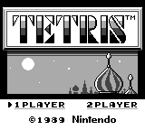
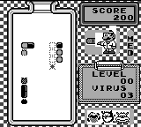

# Another Gameboy Emulator

C project, rendering through SDL.

## Current status

Most of Game Boy games will **NOT** work.
Known to be playable games, with glitches are: Tetris, Dr.Mario.

## Features

* Simple joypad support
* Simple save/restore function
* Embedded simple command-line debugger

  

## Z80 GameBoy CPU

* All the CPU instructions are now implemented
* Code is auto-generated
  * **/resources/table_gb.html** is the main source of data
  * generator is composed of **/tools/{base_gen,cb_gen,gen_z80_instructions}.sh**
* Current status: all CPU instruction tests but **02-interrupt**, from the
  **blargg** test suite are passing.

## TODO

* GPU
  * Background rendering is still messy, need optimization and code clearing
  * Sprite rendering is basic => need to implement sprite tile options
  * Troobleshoot scrolling issues
* Sound support
* Serial link support

## How to

### Build

Under Debian 9 (should work with other linux distributions derived from Debian):

    apt-get install libsdl2-dev cmake
    mkdir build
    cd build
    cmake .. -DCMAKE_BUILD_TYPE:STRING=Release
    make

To enable the built-in debugger

    cmake ../emgb -DCMAKE_BUILD_TYPE:STRING=Release -DUSE_CONSOLE_DEBUGGER=ON
    make

Then type **\<Ctrl\>+C** to enter the debugger and then type **help** to get started.

### Usage

    ./gb ROM_PATH

Keys used are:

 * **W**: start
 * **X**: select
 * **V**: A
 * **C**: C
 * **arrows** for D-pad
 * **F1**: save game state
 * **F2**: restore game state

### Configuration

Everything lies in the **~/.emgb/** directory.

Editing the **config** file allows to change keybindings, colors...
Most configuration entries should be self-explicit.

Lines must have the form **key=value**, with whitespace characters **not stripped** and **no support for comments**.

**Colors** can be given in hexadecimal value **0xRRGGBB**.

**Key names** are those used by the SDL function **SDL_GetKeyName**. Most of the time, it's the character itself, in uppercase if relevant.
Please see [the SDL source code here](http://hg.libsdl.org/SDL/file/4d52395a8dba/src/events/SDL_keyboard.c#l282) and [there](http://hg.libsdl.org/SDL/file/4d52395a8dba/src/events/SDL_keyboard.c#l943) for more information.
### Use a joypad

Run

    mkdir -p ~/.emgb
    ./joypad_mapping ~/.emgb

A configuration file, named after your joypad, will be created in **~/.emgb**.
You can test the joypad configuration with

    ./joypad_mapping --test ~/.emgb

Then launch normally a game, for example

    ./gb ../roms/Tetris.gb

Then you should see lines ressembling what follows:

    looking for /home/nicolas/.emgb//8bitdo_sfc30_gamepad.mapping
    loaded mapping successfully

which indicate that your joypad has been properly configured and detected.
