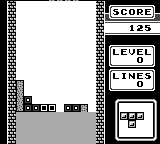

# Another Gameboy Emulator

C project, rendering through SDL.

## Current status

Most of Game Boy games will **NOT** work.
The current rendering is too slow for games to run smoothly.
Known to be playable games, with glitches are: Tetris, Dr.Mario.

## Features

* Simple joypad support
* Embedded simple command-line debugger

  

## Z80 GameBoy CPU

* All the CPU instructions are now implemented
* Code is auto-generated
  * **/resources/table_gb.html** is the main source of data
  * generator is composed of **/tools/{base_gen,cb_gen,gen_z80_instructions}.sh**
* Current status: all CPU instruction tests but **02-interrupt**, from the
  **blargg** test suite are passing.

## TODO

* GPU
  * Background rendering is still messy, need optimization and code clearing
  * Sprite rendering is basic => need to implement sprite tile options
  * Troobleshoot scrolling issues
* Full screen mode
* Sound support
* Serial link support

## How to

### Build

Under Debian 9 (should work with other linux distributions derived from Debian):

    apt-get install libsdl2-dev cmake
    mkdir build
    cd build
    cmake .. -DCMAKE_BUILD_TYPE:STRING=Release
    make

To enable the built-in debugger

    cmake ../emgb -DCMAKE_BUILD_TYPE:STRING=Release -DUSE_CONSOLE_DEBUGGER=ON
    make

Then type **\<Ctrl\>+C** to enter the debugger.

### Usage

    ./gb ROM_PATH

Keys used are:

 * **W**: start
 * **X**: select
 * **V**: A
 * **C**: C
 * **arrows** for D-pad

### Use a joypad

Run

    mkdir -p ~/.emgb
    ./joypad_mapping ~/.emgb

A configuration file, named after your joypad, will be created in **~/.emgb**.
You can test the joypad configuration with

    ./joypad_mapping --test ~/.emgb

Then launch normally a game, for example

    ./gb ../roms/Tetris.gb

Then you should see lines ressembling what follows:

    looking for /home/nicolas/.emgb//8bitdo_sfc30_gamepad.mapping
    loaded mapping successfully

which indicate that your joypad has been properly configured and detected.
